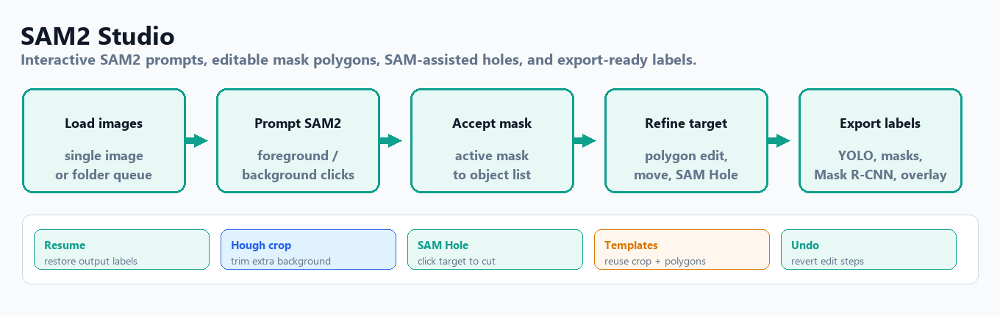
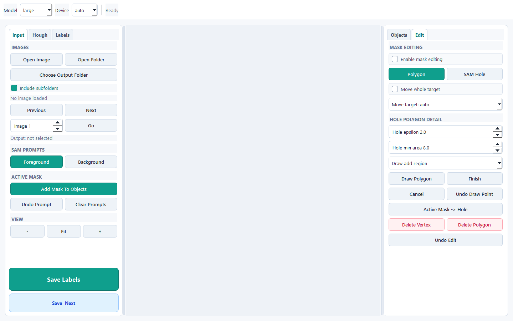

# SAM2 Studio


Windows desktop app for interactive image segmentation with Meta's Segment Anything Model 2. SAM2 is installed from Meta's upstream repository instead of being vendored here.



## What It Does

- Opens a single image or steps through a folder.
- Adds foreground and background clicks to guide SAM2.
- Adjusts accepted masks in polygon edit mode without rerunning SAM2.
- Applies optional Hough or foreground preprocessing before annotation.
- Uses the full masked image or an adaptive center crop.
- Exports YOLO segmentation labels, mask images, Mask R-CNN COCO/RLE annotations, overlays, and object metadata.
- Builds a single-window Windows executable.

## Interface



The app centers on an image canvas with foreground/background clicks and the predicted mask overlay, plus a sidebar for model, preprocessing, and export settings.

## Layout

```text
SAM2-Studio/
  sam2_studio.py
  run_sam_app.bat
  requirements.txt
  assets/
  utils/
  scripts/
  checkpoints/
```

## Installation

Python 3.11 is recommended.

```powershell
python -m venv .venv
.\.venv\Scripts\activate
python -m pip install --upgrade pip
python -m pip install -r requirements.txt
```

For a specific CUDA build, install PyTorch first from the official selector, then the rest.

## Download Checkpoints

```powershell
.\scripts\download_checkpoints.ps1
```

Expected files under `checkpoints/`:

```text
sam2.1_hiera_tiny.pt
sam2.1_hiera_small.pt
sam2.1_hiera_base_plus.pt
sam2.1_hiera_large.pt
```

## Run

```powershell
.\.venv\Scripts\python.exe sam2_studio.py --gui
.\run_sam_app.bat
```

Optional: set `SAM2_STUDIO_IMAGE_DIR` to start the image picker in a specific folder.

## Build The Windows App

```powershell
.\scripts\build_exe.ps1
```

Output is placed at the repo root as `SAM2Studio.exe` and `_internal/`. Keep both together; the executable needs `_internal/` to find Python, PySide6, PyTorch, SAM2, and the packaged checkpoints.

## Notes

- `SAM2Studio.exe`, `_internal/`, `.venv/`, `outputs/`, and `checkpoints/*.pt` are git-ignored.
- To share a ready-to-run build, zip `SAM2Studio.exe` and `_internal/` together.
- To rebuild from source: install requirements, download checkpoints, and run `scripts/build_exe.ps1`.

## Attribution And License

SAM2 Studio depends on Meta's [Segment Anything Model 2](https://github.com/facebookresearch/sam2). Review Meta's SAM2 license and model terms before redistributing checkpoints or packaged builds.

This project's own code is released under the [Apache License 2.0](LICENSE).
